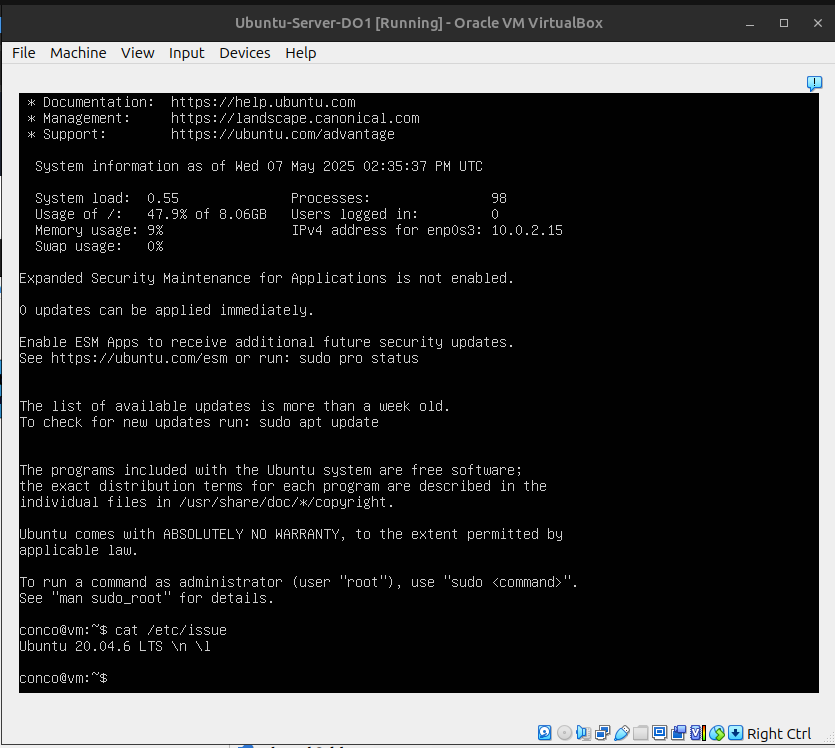
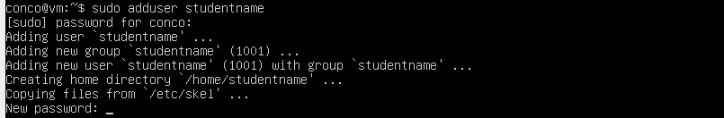
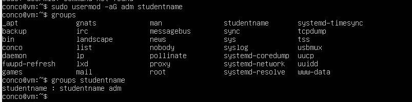
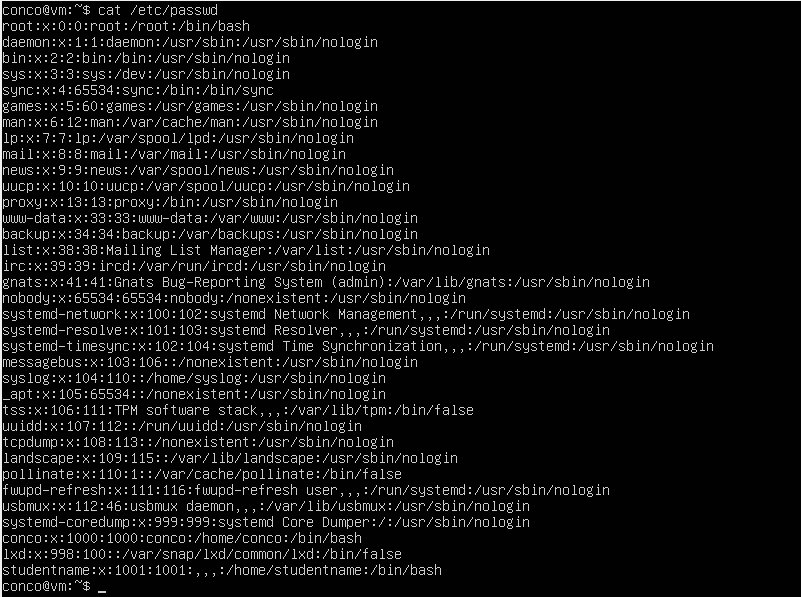
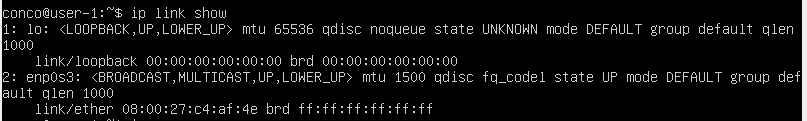
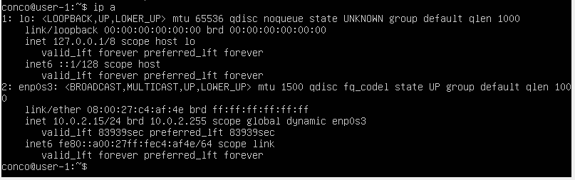
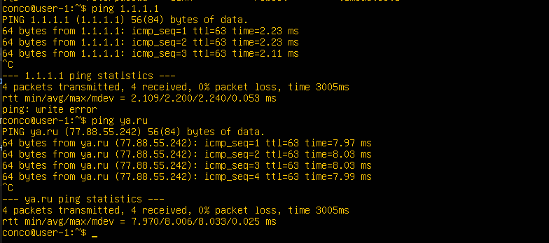
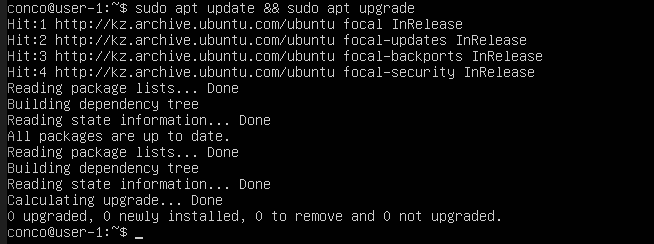
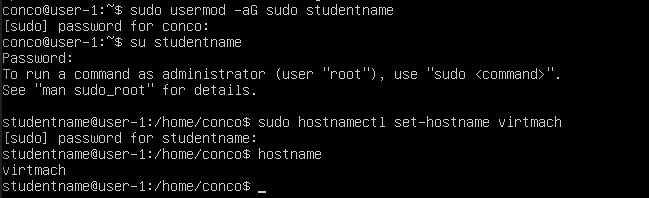

## Part 1. Установка ОС
- Вывод команды `cat /etc/issue`: 

## Part 2. Создание пользователя
- Создаём нового пользователся `studentname` командой `adduser`: 
- Добавляем нового пользователся в группу `adm` командой `usermod`: 
- Вывод команды `cat /etc/passwd`: 

## Part 3. Настройка сети ОС
- Вывод сетевых интерфейсов командой `ip link show`: 
Интерфейс `lo` (**loopback** или *локальный интерфейс*) используется для связи устройства с самим собой и присутствует во всех современных ОС по умолчанию.
- Вывод сетевых интерфейсов командой `ip a`. Адрес `10.0.2.15/24` получен от DHCP-сервера: 
**DHCP** (Dynamic Host Configuration Protocol Протокол динамической настройки узла) - это протокол, в соответствии с которым устройствам в сети автоматически выдаются IP-адреса и другая сетевая информация.
- Пинг по адресам `1.1.1.1` и `ya.ru`: 

1. Для измненеия названия машины редактировал hostname `sudo nano /etc/hostname` с последующей перезагрузкой.
2. Для установления временной зоны `sudo timedatectl set-timezone Europe/Moscow`.
3. Вывел сетевые интрфейсы командой `ip link show`.
4. С помощью `ip a` вывел сетевые интерфейсы с отображением адреса машины.
5. `ip route` для получения gateway, `curl ifconfig.me` для получения внешнего ip-адреса.
6. С помощью `sudo nano /etc/netplan/00-installer-config.yaml` открыл файл и изменил конфигурацию на:
```yaml
network:
  version: 2
  renderer: networkd
  ethernets:
    enp0s3:
      addresses:
        - 10.0.2.99/24
      gateway4: 10.0.2.2
      nameservers:
        addresses: [8.8.8.8, 1.1.1.1]
      dhcp4: no
```
7. Перезагрузил `sudo reboot` и снова открыл файл

## Part 4. Обновление ОС
- Обновил систему командами `sudo apt update && sudo apt upgrade` 
## Part 5. Использование команды sudo
- **sudo** (от **S**ubstitute **U**ser and **do**, ) — это команда, позволяющая обычному пользователю временно выполнять команды от имени администратора (root). Она защищает систему от случайных или вредоносных действий и позволяет контролировать, кто и что может выполнять.
- Изменил *hostname* от пользоветаеля **studentname**, которому добавлена возможность использовать команду `sudo` 
## Part 6. Установка и настройка службы времени

## Part 7. Установка и использование текстовых редакторов
## Part 8. Установка и базовая настройка сервиса SSHD
## Part 9. Установка и использование утилит top, htop
## Part 10. Использование утилиты fdisk
## Part 11. Использование утилиты df
## Part 12. Использование утилиты du
## Part 13. Установка и использование утилиты ncdu
## Part 14. Работа с системными журналами
## Part 15. Использование планировщика заданий CRON
- фыва