## Part 1. Установка ОС
- Вывод команды `cat /etc/issue`: 

## Part 2. Создание пользователя
- Создаём нового пользователся `studentname` командой `adduser`: 
- Добавляем нового пользователся в группу `adm` командой `usermod`: 
- Вывод команды `cat /etc/passwd`: 

## Part 3. Настройка сети ОС
- Вывод сетевых интерфейсов командой `ip link show`: 
Интерфейс `lo` (**loopback** или *локальный интерфейс*) используется для связи устройства с самим собой и присутствует во всех современных ОС по умолчанию.
- Вывод сетевых интерфейсов командой `ip a`. Адрес `10.0.2.15/24` получен от DHCP-сервера: 
**DHCP** (Dynamic Host Configuration Protocol Протокол динамической настройки узла) - это протокол, в соответствии с которым устройствам в сети автоматически выдаются IP-адреса и другая сетевая информация.
- Пинг по адресам `1.1.1.1` и `ya.ru`: 

1. Для измненеия названия машины редактировал hostname `sudo nano /etc/hostname` с последующей перезагрузкой.
2. Для установления временной зоны `sudo timedatectl set-timezone Europe/Moscow`.
3. Вывел сетевые интрфейсы командой `ip link show`.
4. С помощью `ip a` вывел сетевые интерфейсы с отображением адреса машины.
5. `ip route` для получения gateway, `curl ifconfig.me` для получения внешнего ip-адреса.
6. С помощью `sudo nano /etc/netplan/00-installer-config.yaml` открыл файл и изменил конфигурацию на:
```yaml
network:
  version: 2
  renderer: networkd
  ethernets:
    enp0s3:
      addresses:
        - 10.0.2.99/24
      gateway4: 10.0.2.2
      nameservers:
        addresses: [8.8.8.8, 1.1.1.1]
      dhcp4: no
```
7. Перезагрузил `sudo reboot` и снова открыл файл

## Part 4. Обновление ОС
- Обновил систему командами `sudo apt update && sudo apt upgrade` 
## Part 5. Использование команды sudo
- **sudo** (от **S**ubstitute **U**ser and **do**, ) — это команда, позволяющая обычному пользователю временно выполнять команды от имени администратора (root). Она защищает систему от случайных или вредоносных действий и позволяет контролировать, кто и что может выполнять.
- Изменил *hostname* от пользоветаеля **studentname**, которому добавлена возможность использовать команду `sudo` 
## Part 6. Установка и настройка службы времени
- Вывод команды `timeditectl show` 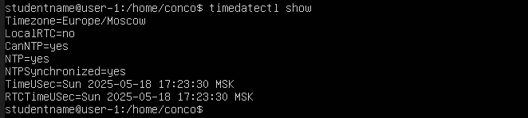 для включения автоматической синхронизации времени использовал команду `sudo timedatectl set-ntp true`
## Part 7. Установка и использование текстовых редакторов
- **vim** и **nano** уже установлены "из коробки", поэтому установим **neovim** `sudo apt install neovim`
### Создание файлов и сохранение
--**nano**--
1. Открыть терминал и ввести:
`nano test_nano.txt`
2. В открывшемся редакторе ввести свой никнейм
3. Нажать `Ctrl + O` (сохранение файла).
4. Нажать **Enter** (подтвердить имя файла).
5. Нажать `Ctrl + X` (выход из редактора).

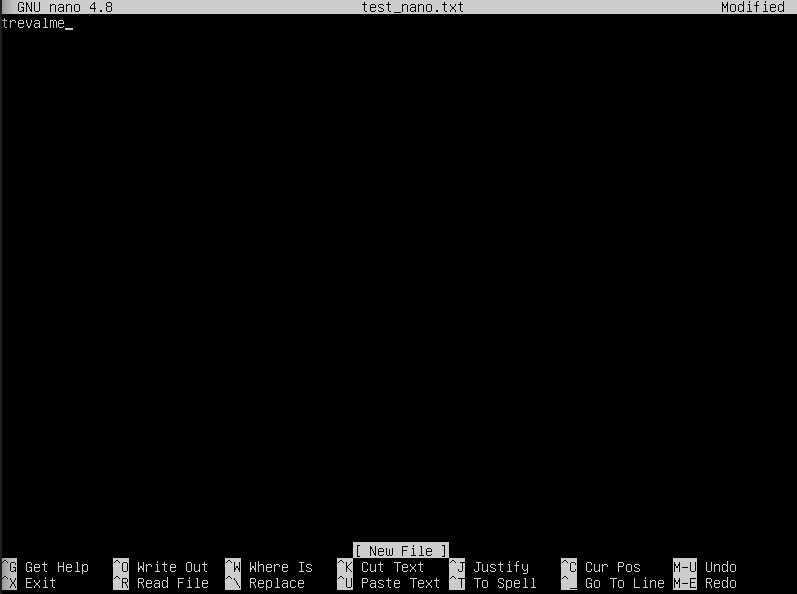

--**vim**--
1. В терминале вести:
`vim test_vim.txt`
2. Нажать **i** — переход в режим вставки.
3. Написать свой никнейм
4. Нажать **Esc** — выйти из режима вставки.
5. Ввести `:wq` и нажать **Enter** — сохранить и выйти.

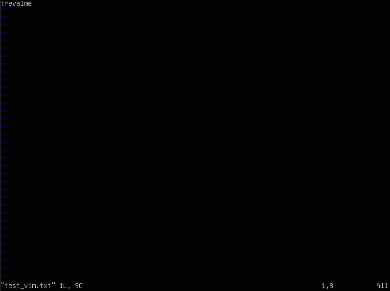

--**nvim**-- *Аналогично с vim:*
1. В терминале вести:
`nvim test_nvim.txt`
2. Нажать **i** — переход в режим вставки.
3. Написать свой никнейм
4. Нажать **Esc** — выйти из режима вставки.
5. Ввести `:wq` и нажать **Enter** — сохранить и выйти.

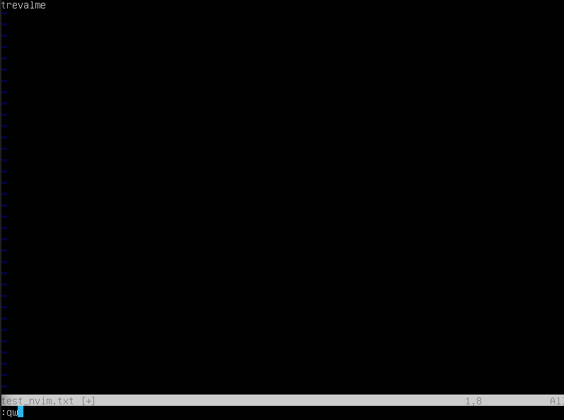

### Редактирование и выход без сохранения

--**nano**--
1. Открыть файл: `nano test_nano.txt`
2. Поменять текст
3. Нажать `Ctrl + X` — появляется вопрос: Save modified buffer? 
4. Нажать `N` — выйти без сохранения.

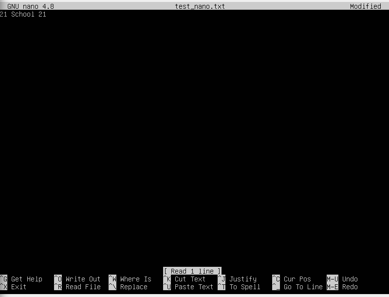

--**vim**--
1. Открыть файл: `vim test_vim.txt`
2. Нажать `i` — режим вставки.
3. Поменять текст
4. Нажать **Esc**.
5. Выйти без сохранения: `:q!` и нажать **Enter**.

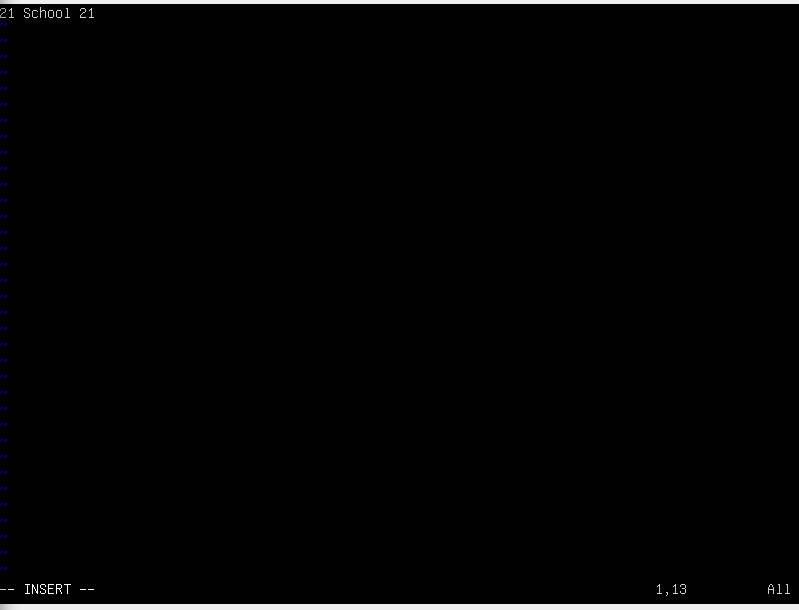

--**nvim**-- *Аналогично с vim:*
1. Открыть файл: `nvim test_nvim.txt`
2. Нажать `i` — режим вставки.
3. Поменять текст
4. Нажать **Esc**.
5. Выйти без сохранения: `:q!` и нажать **Enter**.


### Поиск и замена

--**nano**--
- Для поиска фрагменат **Ctrl** + **W** 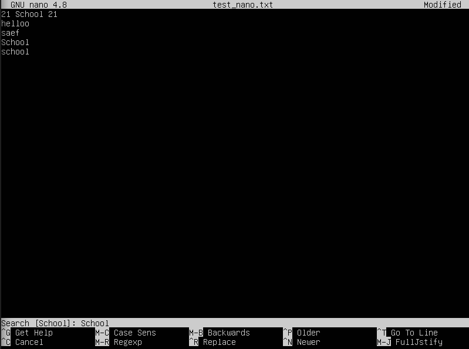
- Для замены **Ctrl** + **/** 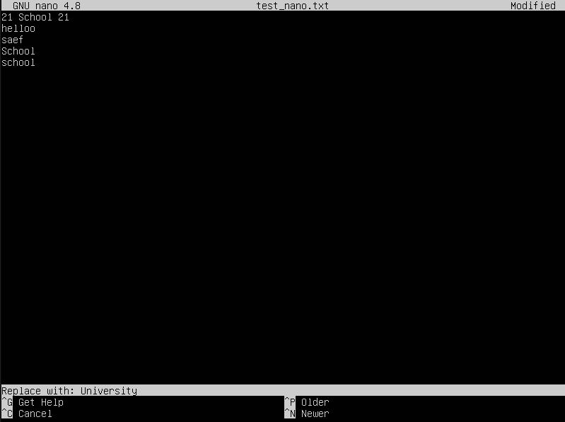

--**vim**--
- Для поиска фрагменат "/" в командном режиме 
- Для замены ":%s:/School/University/g" 

--**nvim**-- *Аналогично с vim:*
- Для поиска фрагменат "/" в командном режиме 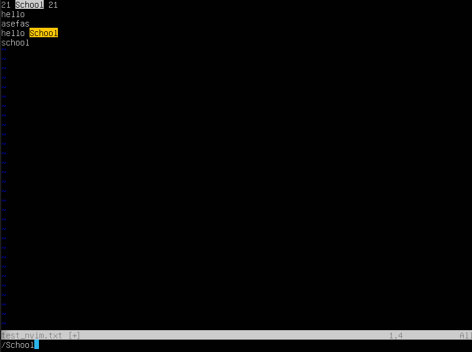
- Для замены ":%s:/School/University/g" 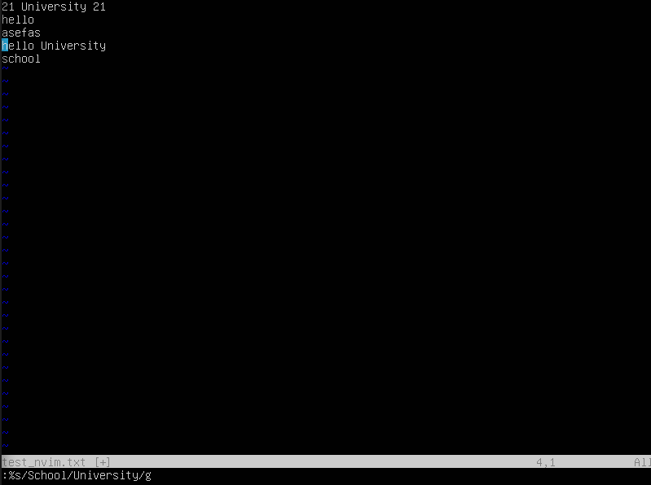

## Part 8. Установка и базовая настройка сервиса SSHD
1. Установить службу SSHd командой `sudo apt install openssh-server`
2. Добавить в автозапуск и включть в текущей сессии
`sudo systemctl enable ssh` `sudo systemctl start ssh`
3. Редактируем конфиг `etc/ssh/sshd_config`, раскоменировав и изменив номер порта, перезапускаем службу `sudo systemctl restart ssh`
4. Для вывода процесса можно использовать `ps -ef`, где ключ **e** используется для вывода всех процессов, а **f** для расширения формата выводимой информации (+ UID, PID, PPID, CMD). Для удобства можно грепнуть `ps -ef | grep sshd`
5. `sudo reboot` для перезагрузки виртуальной машины

- 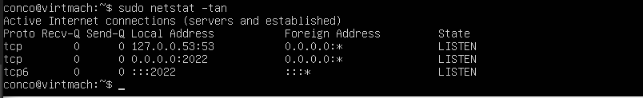
**Значение ключей -tan**: <br>`-t` показать только TCP-соединения, <br>`-a` показать все подключения (и прослушивание, и установленные)<br> `-n` показать IP-адреса и номера портов в числовом виде, без DNS-имен <br>
**Значение каждого столбца вывода**:
***Proto*** - протокол соединения  <br>
***Recv-Q/Send-Q*** - кол-во полученных/отправленных байтов в очереди  <br>
***Local Adress*** - локальный адрес и порт, где sshd слушает подключения <br>
***Foreign Adress*** - удалённый адрес <br>
***State*** - текущее состояние соединения <br>
**Значение 0.0.0.0.**: это «универсальный адрес» — SSH слушает на всех интерфейсах, т.е. доступен с любого IP-адреса машины


## Part 9. Установка и использование утилит top, htop
## Part 10. Использование утилиты fdisk
## Part 11. Использование утилиты df
## Part 12. Использование утилиты du
## Part 13. Установка и использование утилиты ncdu
## Part 14. Работа с системными журналами
## Part 15. Использование планировщика заданий CRON
